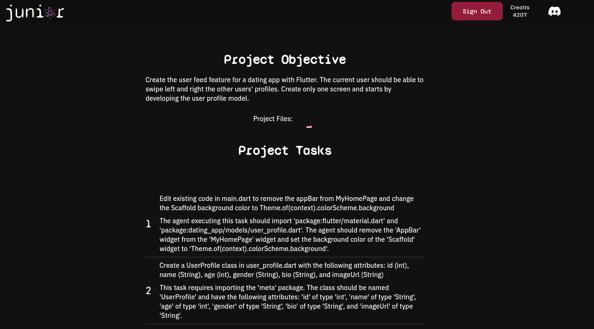

# Example for the Flutter Codebase: User Feed for a Dating App

  

**Learn more at [junior.atomsbox.com](https://junior.atomsbox.com)!**

---

### PROMPT: Create the user feed feature for a dating app with Flutter. The current user should be able to swipe left and right the other users' profiles. Create only one screen and starts by developing the user profile model. 

- Project name: dating_app
- Project directory: dating_app
- Project description: Create the user feed feature for a dating app with Flutter. The current user should be able to swipe left and right the other users' profiles. Create only one screen and starts by developing the user profile model. 
- Number of tasks: 16
- Model: Advanced Model 

**Full codebase (as created by the model):** [dating_app](https://github.com/maxonflutter/junior-AI-Generated-Flutter-Code/tree/main/flutter_codebase/user_feed_for_a_dating_app/dating_app)

### Initial List of Tasks from the Model:
1. Edit existing code to remove the appBar from MyHomePage and change the Scaffold background color to Theme.of(context).colorScheme.background
2. Write code to create a UserProfile class with attributes: id, name, age, gender, bio, and imageUrl
3. Write code to create a UserProfileCard widget that takes a UserProfile object as a parameter and displays the user's name, age, gender, bio, and imageUrl
4. Write code to create a UserFeedBloc class with a StreamController for managing the user feed
5. Write code to create a method in UserFeedBloc that fetches a list of UserProfile objects and adds them to the StreamController
6. Write code to create a UserFeedProvider class that uses InheritedWidget to provide the UserFeedBloc to its descendants
7. Edit existing code to wrap the MaterialApp widget with a UserFeedProvider in MyApp
8. Write code to create a SwipeableCardStack widget that takes a list of UserProfileCard widgets and allows the user to swipe left or right
9. Write code to create a UserFeedScreen StatefulWidget that displays a SwipeableCardStack with UserProfileCard widgets
10. Edit existing code to replace the Container in the body of _MyHomePageState with the UserFeedScreen widget
11. Write code to create a method in UserFeedBloc that handles swiping left or right on a UserProfileCard by removing it from the list and adding a new UserProfile to the list
12. Edit existing code to call the method from task 11 when a UserProfileCard is swiped left or right in the SwipeableCardStack widget
13. Write code to create a method in UserFeedBloc that saves the swiped UserProfile's id and swipe direction (left or right) to a local database or file
14. Edit existing code to call the method from task 13 when a UserProfileCard is swiped left or right in the SwipeableCardStack widget
15. Write code to create a method in UserFeedBloc that retrieves the saved swipe data from the local database or file and returns a list of swiped UserProfile ids and their swipe direction
16. Write code to create a test function that verifies the functionality of the UserFeedBloc methods and the UserFeedScreen

### Final List of Tasks from the Model:
1. "Edit existing code in main.dart to remove the appBar from MyHomePage and change the Scaffold background color to Theme.of(context).colorScheme.background". "The agent executing this task should import 'package:flutter/material.dart' and 'package:dating_app/models/user_profile.dart'. The agent should remove the 'AppBar' widget from the 'MyHomePage' widget and set the background color of the 'Scaffold' widget to 'Theme.of(context).colorScheme.background'."
2. "Create a UserProfile class in user_profile.dart with the following attributes: id (int), name (String), age (int), gender (String), bio (String), and imageUrl (String)". "This task requires importing the 'meta' package. The class should be named 'UserProfile' and have the following attributes: 'id' of type 'int', 'name' of type 'String', 'age' of type 'int', 'gender' of type 'String', 'bio' of type 'String', and 'imageUrl' of type 'String'."
3. "Create a UserProfileCard widget in user_profile_card.dart that takes a UserProfile object as a parameter and displays the user's name (String), age (int), gender (String), bio (String), and imageUrl (String)". "This task requires importing the UserProfile class from 'lib/models/user_profile.dart'. The UserProfileCard widget should take a UserProfile object as a parameter and display the following attributes: name (String), age (int), gender (String), bio (String), and imageUrl (String). The widget should use the 'Card' widget from the 'material' package to display the user's information. The 'imageUrl' attribute should be used to display the user's profile picture. If the 'imageUrl' is null, a default image should be displayed. The 'Text' widget should be used to display the user's name, age, gender, and bio. The 'TextStyle' for the name should be bold and larger than the other attributes. The 'TextStyle' for the age, gender, and bio should be smaller than the name. The 'Column' widget should be used to display the user's information in a vertical layout."
4. "Create a UserFeedBloc class in user_feed_bloc.dart with a StreamController for managing the user feed". "This task requires the following imports: 'dart:async', 'package:flutter/material.dart', 'package:dating_app/models/user_profile.dart'. To create the UserFeedBloc class, initialize a StreamController with a List<UserProfile> as the initial data. The class should have a method that fetches a list of UserProfile objects and adds them to the StreamController. Additionally, create a method that handles swiping left or right on a UserProfileCard by removing it from the list and adding a new UserProfile to the list. Finally, create a method that saves the swiped UserProfile's id (int) and swipe direction (String) (left or right) to a local database or file. This task requires the following classes: 'UserProfile'.
5. "Create a method in UserFeedBloc in user_feed_bloc.dart that fetches a list of UserProfile objects and adds them to the StreamController". "This task requires importing the UserProfile class from user_profile.dart. The method should be named 'fetchUserProfiles' and take no arguments. It should create a List<UserProfile> object and add some sample UserProfile objects to it. Then, it should add the list to the StreamController using the 'add' method. If there is an error, it should be added to the StreamController using the 'addError' method."
6. "Create a UserFeedProvider class in user_feed_provider.dart that uses InheritedWidget to provide the UserFeedBloc to its descendants". "This task requires importing the UserFeedBloc from 'bloc/user_feed_bloc.dart'. The UserFeedProvider class should extend InheritedWidget and have a constructor that takes a UserFeedBloc as a parameter. The UserFeedProvider should override the updateShouldNotify method to return true if the new UserFeedBloc is different from the old one. The UserFeedProvider should have a static method called 'of' that takes a BuildContext and returns the UserFeedBloc from the nearest ancestor UserFeedProvider. This method should throw an error if no UserFeedProvider is found in the widget tree."
7. "Wrap the MaterialApp widget with a UserFeedProvider in main.dart". "Import 'providers/user_feed_provider.dart' in main.dart. Create a UserFeedProvider instance and wrap the MaterialApp widget with it. Pass the UserFeedBloc instance to the UserFeedProvider constructor."
8. "Create a SwipeableCardStack widget in swipeable_card_stack.dart that takes a list of UserProfileCard widgets and allows the user to swipe left or right". "This task requires importing the following: - UserProfileCard class from 'lib/widgets/user_profile_card.dart' - UserFeedBloc class from 'lib/bloc/user_feed_bloc.dart' - UserProfile class from 'lib/models/user_profile.dart' The SwipeableCardStack widget should be created with the following arguments: - A List of UserProfileCard widgets as a required parameter - A callback function that takes a UserProfile object and a String indicating the swipe direction (left or right) as parameters. This function should call the 'swipeUserProfile' method in the UserFeedBloc class with the UserProfile object and swipe direction as arguments. The SwipeableCardStack widget should use the following: - A PageView widget to display the UserProfileCard widgets - A GestureDetector widget to detect swipe gestures - An AnimatedBuilder widget to animate the swipe gestures - The callback function mentioned above to handle the swipe gestures It is important to note that the UserProfileCard widgets should be wrapped in a GestureDetector widget to detect tap gestures for opening the user's profile. Also, the AnimatedBuilder widget should use the swipe gesture details to animate the UserProfileCard widgets off the screen in the swipe direction."
9. "Create a UserFeedScreen StatefulWidget in user_feed_screen.dart that displays a SwipeableCardStack with UserProfileCard widgets". "This task requires importing the following files: - 'lib/models/user_profile.dart' for the UserProfile class - 'lib/bloc/user_feed_bloc.dart' for the UserFeedBloc class - 'lib/widgets/swipeable_card_stack.dart' for the SwipeableCardStack widget - 'lib/widgets/user_profile_card.dart' for the UserProfileCard widget The UserFeedScreen StatefulWidget should have a State class that initializes a UserFeedBloc object and calls its method to fetch a list of UserProfile objects. The State class should also have a SwipeableCardStack widget that takes the list of UserProfileCard widgets as a parameter and allows the user to swipe left or right. Finally, the UserFeedScreen StatefulWidget should be wrapped with a UserFeedProvider widget that provides the UserFeedBloc to its descendants."
10. "Replace the Container in the body of _MyHomePageState with the UserFeedScreen widget in main.dart"
file_path". "The UserFeedScreen widget should be imported from 'lib/screens/user_feed_screen.dart' and initialized with the UserFeedBloc from the UserFeedProvider. The UserFeedProvider should be imported from 'lib/providers/user_feed_provider.dart'."
11. "Create a method in UserFeedBloc in user_feed_bloc.dart that handles swiping left or right on a UserProfileCard by removing it from the list and adding a new UserProfile to the list". "This task requires the following imports: 'package:flutter/material.dart', 'package:dating_app/models/user_profile.dart'. The method should be named 'handleSwipe' and take two arguments: a UserProfile object and a boolean indicating whether the swipe was left or right. The method should remove the swiped UserProfile from the list of UserProfiles and add a new UserProfile to the list. The new UserProfile should be fetched from a database or API. If the list of UserProfiles is empty, the method should fetch a new list from the database or API. If the swiped UserProfile is not already in the list of swiped UserProfiles, the method should save the swiped UserProfile's id and swipe direction to a local database or file."
12. "Call the method from task 11 when a UserProfileCard is swiped left or right in the SwipeableCardStack widget in swipeable_card_stack.dart". "This task requires importing the UserFeedBloc class from 'lib/bloc/user_feed_bloc.dart'. The method to be called is 'handleSwipe' and it takes a UserProfile object and a String representing the swipe direction ('left' or 'right') as arguments. The SwipeableCardStack widget should listen to swipe events and call the 'handleSwipe' method with the appropriate arguments. It is important to note that the UserFeedBloc class should be initialized before calling the method."
13. "Create a method in UserFeedBloc in user_feed_bloc.dart that saves the swiped UserProfile's id (int) and swipe direction (String) (left or right) to a local database or file". "This task requires importing the following packages: - path_provider: ^2.0.1 - path: ^1.8.0 The method should be named 'saveSwipeData' and take two parameters: 'id' (int) and 'direction' (String). It should use the 'getApplicationDocumentsDirectory' method from the path_provider package to get the local directory path and the 'join' method from the path package to join the directory path with a file name 'swipe_data.json'. If the file does not exist, it should be created. The method should then read the contents of the file, parse it as a JSON object, append the new swipe data to the list, and write the updated JSON object back to the file. If there is an error with reading or writing the file, it should be logged to the console. The isolated context for this task includes the necessary imports, method name, parameters, and implementation details."
14. "Call the method from task 13 when a UserProfileCard is swiped left or right in the SwipeableCardStack widget in swipeable_card_stack.dart". "This task requires importing the UserFeedBloc class from 'lib/bloc/user_feed_bloc.dart'. The method to be called is 'saveSwipeData' and it requires two arguments: the id of the swiped UserProfile (int) and the direction of the swipe (String) (left or right). Before calling the method, it is necessary to initialize an instance of UserFeedBloc using the UserFeedProvider widget. This can be done by wrapping the SwipeableCardStack widget with a UserFeedProvider and accessing the UserFeedBloc instance using the 'of' method. If the UserFeedBloc instance already exists, it should not be initialized again."
15. "Create a method in UserFeedBloc in user_feed_bloc.dart that retrieves the saved swipe data from the local database or file and returns a list of swiped UserProfile ids (int) and their swipe direction (String)". "This task requires importing the necessary packages to interact with the local database or file system. The method should take in the path to the local database or file as an argument. The method should then retrieve the saved swipe data from the database or file and return a list of swiped UserProfile ids (int) and their swipe direction (String). If no swipe data is found, the method should return an empty list. It is important to note that this method should not modify the local database or file in any way."
16. "Create a test function in user_feed_test.dart that verifies the functionality of the UserFeedBloc methods and the UserFeedScreen". "This task requires importing the necessary classes and functions for testing the UserFeedBloc methods and the UserFeedScreen. The imports needed are: - import 'package:flutter_test/flutter_test.dart'; - import 'package:dating_app/bloc/user_feed_bloc.dart'; - import 'package:dating_app/providers/user_feed_provider.dart'; - import 'package:dating_app/screens/user_feed_screen.dart'; The test function should be named testUserFeedFunctionality() and it should be wrapped in a group named 'User Feed Functionality'. The test function should first create a UserFeedBloc and a UserFeedProvider, and then use the provider to wrap a UserFeedScreen widget. The test function should then simulate swiping left and right on the UserProfileCards in the SwipeableCardStack widget and verify that the UserFeedBloc methods are functioning correctly by checking that the swiped UserProfile ids and swipe directions are being saved and retrieved correctly from the local database or file."